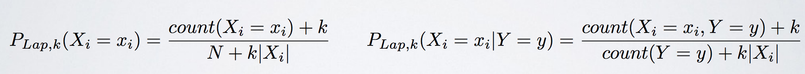
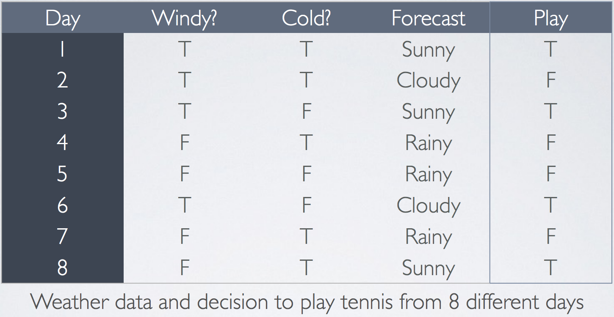
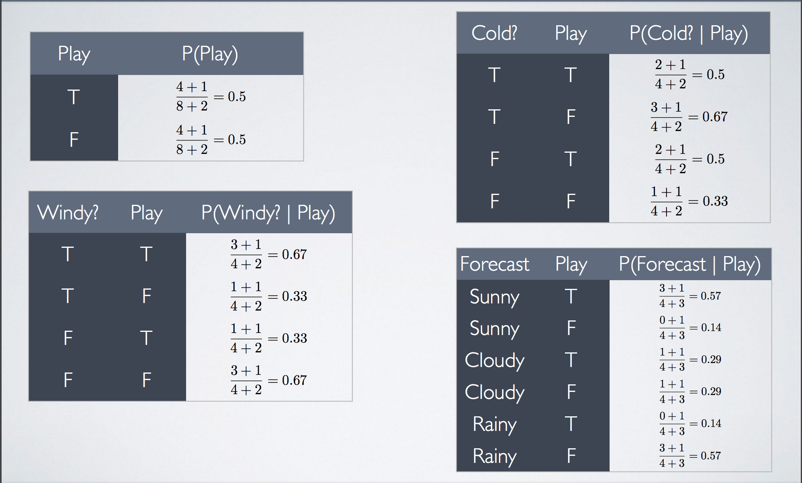

## Word Level Spelling Check ( Noisy Channel )

### Noisy Channel

- Def : The noisy channel model is a framework used in spell checkers, question answering, speech recognition, and machine translation. In this model, the goal is to find the intended word given a word where the letters have been scrambled in some manner.

-  以機器翻譯（machine translation）為例子

如果，要把中文翻譯成英文，則可用計算某個中文句子翻譯成英文句子的機率，來找出哪個翻譯結果，是比較好的翻譯。給定中文句子 c ，它翻譯成某個英文句子 e 的機率，為 p(e∣c) ，即為，在中文句子為 c 的條件下，出現英文句子 e 的條件機率。

會需要兩個成分（ 基於貝式定理 P(e|c) = P(e)*P(c|e)/P(c) ）

1. language model: P(e) 表示英文句子 e 在語料庫中的機率。用單一一種語言的語料庫做訓練即可。

2. translation model: P(c|e) 表示英文句子 e ，在此條件下，翻譯成中文句子 c 的機率。要建立此模型，需要用平行語料庫做訓練。

並求出P(e|c)最大者，即P(e)*P(c|e)

### Smoothing:Add-one(Laplace):

- What if you’ve never seen feature before?

    - Joint probability becomes 0

    - Just because an event has not happened before, does not mean that it won’t ever happen. 

    - Use Laplace smoothing for Max Likelihood estimates.“Pretend you’ve seen each variable k extra times”

    

#### eg. Prediction of playing tennis



After laplace smoothing


**the prob should be 0, BUT after laplace smoothing**

- Using Laplace smoothed (k=1) NB estimates,
what is the probability that they will Play, with
Windy = T, Cold = F, and Forecast = Rainy

Answer:<br/>
P(Play=T)*P(Windy=T | Play=T) * P(Cold = F | Play=T) * P(Forecast=Rainy | Play=T)
= (0.5)(0.67)(0.5) (0.14)
= 0.02

## 而在spelling checking則是P(correct|wrong)

1. Language Model: P(correct)

2. Correct Model: P(wrong|correct) [may have 0, so do laplace smoothing]
    
    1. 我們只對 count<10 的做 laplace

    2. N(count<10的種類數)

    3. C(Ｘ)表示X狀況的數量

    4. P(wrong|correct) = C(wrong^correct)+1/C(correct)+N


-----------

### Input :

1. big.txt (for language model)

2. count_1edit.txt (for correct model)

### Process :

1. get all states(L,R,edits,P(correct),P(wrong|correct)) with beam search

    0. P(correct)[0->10**(-30)]和P(wrong|correct)[laplace]都有經過 smoothing ps. 其實P(correct)應該也要用laplace只是因為懶

    1. left the unique word (keep the smaller edits)

    2. sort by P(correct)*P(wrong|correct) then sort by edit desc then prun top 500[越好的結果]

2. 最後列出P(correct|wrong)最佳的三個

### Output:

```
pprint(correction('appearant'))
[('apparent', '', 2, 3.764840868244015e-05, 0.01018676187828061),
 ('appearance', '', 2, 0.00012101274219355764, 0.0011182874238227151),
 ('appearing', '', 2, 2.061698570705056e-05, 0.0008387047619047624)]

pprint(correction('brack'))
[('black', '', 1, 0.0002106518104850818, 0.03375824175824176),
 ('back', '', 1, 0.0006687074494547703, 0.0067889502762430946),
 ('branch', '', 2, 4.571592482867733e-05, 0.03684993093669402)]

pprint(correction('happy'))
[('happy', '', 0, 0.00019541316887552272, 0.32768000000000014),
 ('happen', '', 2, 8.874267760860894e-05, 0.0023614255765199168),
 ('apply', '', 2, 3.85447993653554e-05, 0.0013160173160173163)]

...

```

